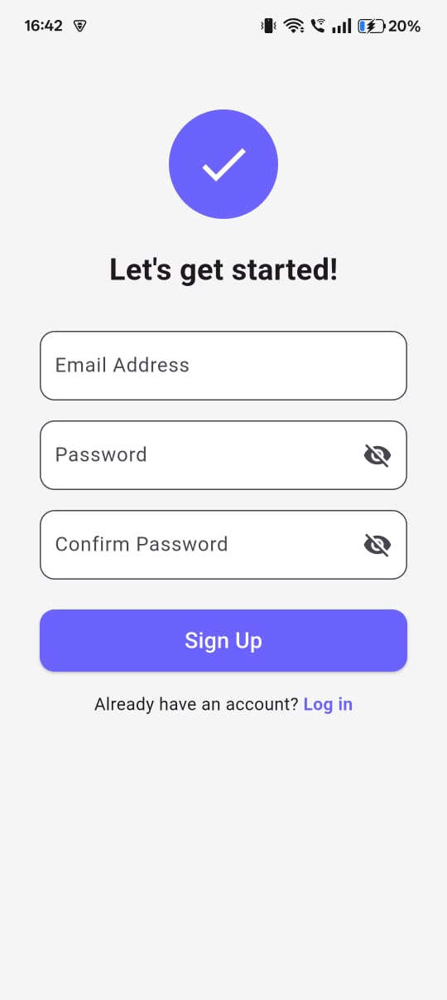

# Task Management App

A simple Flutter task management app to add, edit, delete, and view tasks.

## Features

- User login and registration with Firebase Authentication.
- Add tasks with title, description, due date, and priority (High, Medium, Low).
- View tasks in a list sorted by due date (Today, Tomorrow, This Week).
- Edit and delete tasks.
- Mark tasks as completed.
- Filter tasks by priority and status.
- Search for tasks.
- Secure data storage with Firebase Firestore.

## Tech Stack

- Flutter & Dart
- Firebase Authentication
- Cloud Firestore

## Screenshots

## Getting Started

1. Clone this repository.
2. Run `flutter pub get` to get dependencies.
3. Connect your Firebase project.
4. Run `flutter run` to start the app.